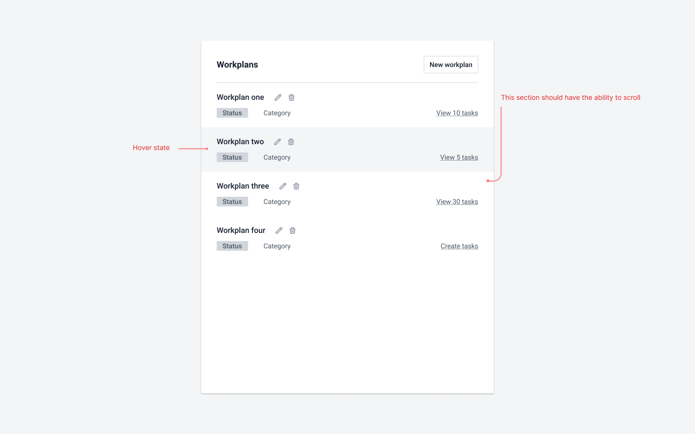
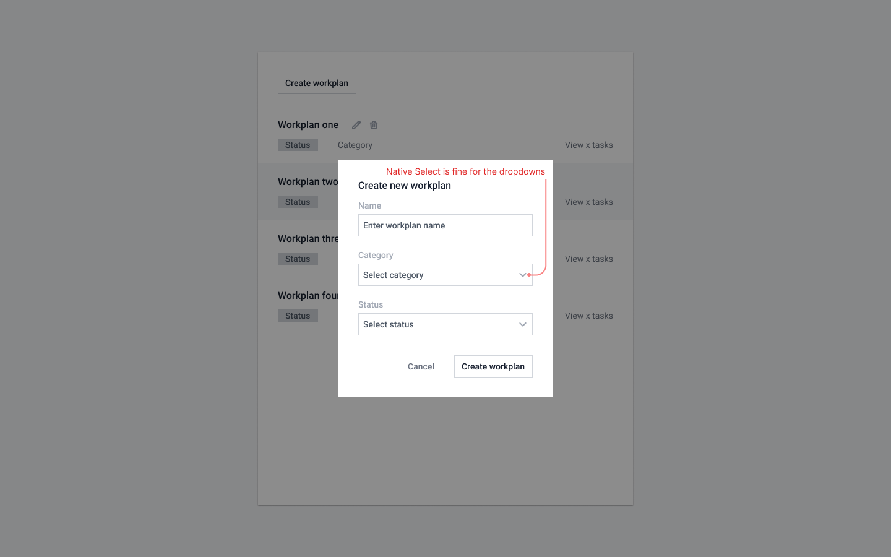
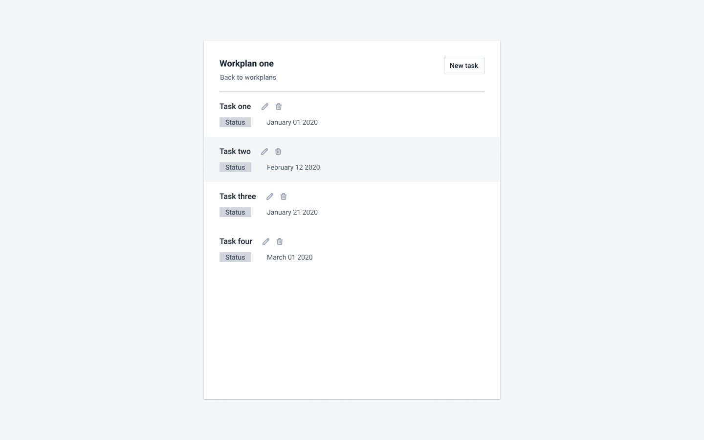
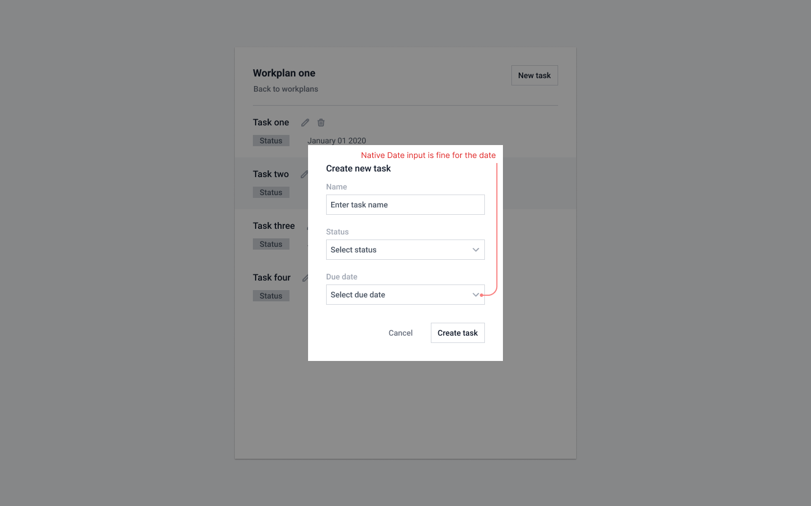

# Maestro Full-Stack Take-Home Test

Your assignment is to build a Workplan/Task list web application that follows the design shown below (full design details in (`full-stack-take-home.fig`, which is a [Figma](https://www.figma.com/) file). The application will have 3 main components: Front-End React UI, Server and Database.

### Application Functionality

The application will provide functionality to support create, read, update and delete (CRUD) operations on workplans and tasks, and support navigation between them.

Workplans:

- A Workplan has a name, status, category and one or more tasks.
- Valid statuses are "Not Started", "In Progress", and "Complete".
- Valid categories are "Engineering", "Sales", and "Product".
- In addition to listing it's other attributes, the workplan view should list the number of tasks per workplan and be able to navigate to it's task list via a link (see design), as well as be able to create a task when none exist.

Tasks:

- belong to one Workplan
- have a name, status (same values as above) and due date.
- support crud operations
- support navigation back to Workplans

### Requirements

Frontend:

- must be a single-page React application, that communicates with API endpoints served from a backend server you will write.
- match design as close as possible
- can use third party packages if desired to expedite developement (icons, widgets, libraries, etc..)

Backend/Database:

- The server can be built using any framework of your choosing (i.e Rails, Django, Node, Flask, etc.)
- The server should store the application's data in a relational database of your choosing (i.e. MySql, Postgres, SqlLite, etc).
- The server should expose application data (no markup or styling) to the frontend via REST or GraphQL APIs
- The server does not need to authenticate requests

### Getting started

- To create your initial front-end app, use `create-react-app` (https://reactjs.org/docs/create-a-new-react-app.html#create-react-app)
- Follow documentation/tutorials from your web framework of choice to setup initial server and database

### What we're looking for

Frontend:

- logical encapsulation of UI components
- efficient fetching of data from server
- use of hooks and state management
- attention to detail matching your code to the design

Backend:

- intuitive data modeling and use of ORM if supported by your framework
- performant and well thought-out REST/Graphql API endpoints that support CRUD operations for Workplans and Tasks.
- best practices with database schema (indexes, fk constraints, enums, etc)

### What we're not looking for

- **Tests.**
  If they assist you in building the project than by all means write them but we're looking for implementing the design and functionality so don't prioritize them.

### Submitting

Along with your code, create a short `README.md` file that talks about any interesting things you ran into and/or decisions you made etc. Also use this as a place to tell us any context around a certain decision you've made or if you couldn't get something completed, explain what you would do if you had more time.

Once done, create a public or private repo on Github. If it's private then you can invite the interviewer (`bill-filler`).

### Other

Extra Credit:

- Optionally, add functionality to support creating and displaying comments for a given task!
